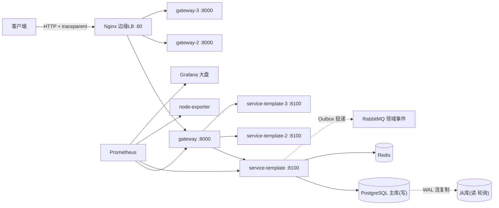
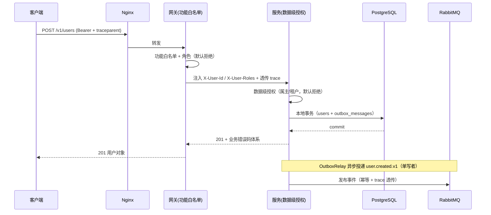
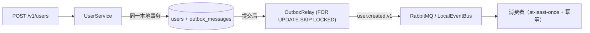
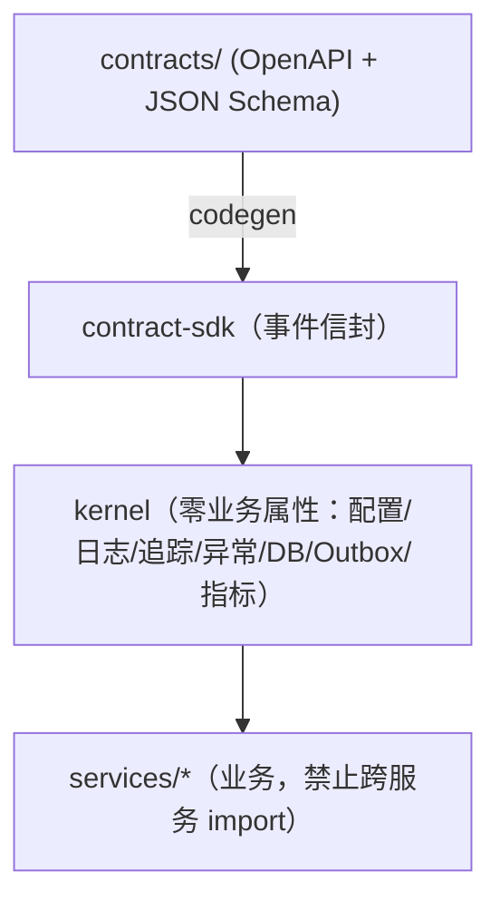
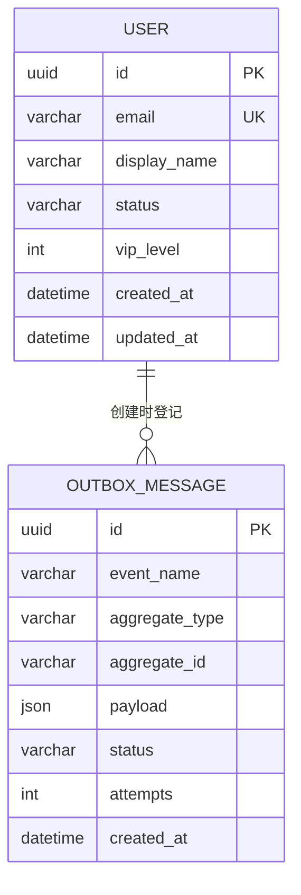

# 项目地图

> 给开发者 / 产品 / AI / 测试的全局导航。机器可读版本见 [`project-map.yaml`](https://github.com/php-chen/ai-big-project/blob/main/project-map.yaml)（CI 校验防漂移）。

## 5 分钟看懂这个项目

**它是什么**：基于 Python 3.14 + FastAPI 的微服务 monorepo，以 5 条物理定律为地基
（契约优先 / 数据主权 / 双层鉴权 / 最终一致性+Outbox / 可观测性）。

**读项目顺序**：

1. `AGENTS.md` —— 架构宪法（最高约束，AI 每次会话自动继承）
2. 本文档 —— 全局地图
3. `docs/architecture/` —— 定律司法解释、数据归属矩阵、洋葱边界
4. `contracts/` —— 所有接口与事件的唯一事实来源
5. `docs/standards/` —— 状态码/日志/数据库/负载均衡/动态扩容/资源监控/测试规范
6. `docs/module-specs/` —— 每个服务的模块说明书（六要素）

## 系统架构



## 一次请求的完整链路



## 领域事件流



## 模块依赖（洋葱模型）



## 数据归属（每张表只有一个 Owner）



| 表 | Owner | 说明 |
|---|---|---|
| users | service-template | 用户基础信息 |
| outbox_messages | service-template | 事务发件箱（定律4） |

## 模块索引

### 包

| 包 | 路径 | 说明 | 依赖 |
|---|---|---|---|
| contract-sdk | `packages/contract-sdk` | 契约 SDK（事件信封 + schema） | - |
| kernel | `packages/kernel` | 共享内核（零业务属性） | contract-sdk |

### 服务

| 服务 | 端口 | 拥有表 | 发布事件 | 说明 |
|---|---|---|---|---|
| gateway | 8000 | - | - | 功能白名单 + 身份注入 + trace + 客户端侧 LB |
| service-template | 8100 | users, outbox_messages | user.created.v1 | 用户服务（原型） |

### 中间件

| 组件 | 角色 | 端口 |
|---|---|---|
| PostgreSQL 16 | 主库写 / 从库读（轮询） | 5432 |
| Redis 7 | 幂等 / 服务注册 / 缓存 | 6379 |
| RabbitMQ 3 | 领域事件（当前代码用 LocalEventBus） | 5672 |

### 契约

| 类型 | 文件 | 说明 |
|---|---|---|
| HTTP | `contracts/http/template.openapi.yaml` | 用户服务 API 契约 |
| 事件 | `contracts/events/user.created.schema.json` | 用户创建事件 |

## 部署与运维

- 完整编排：`deploy/docker-compose.prod.yml`（Nginx/网关×3/服务×3/主从PG）
- 小内存单节点：`deploy/docker-compose.single.yml`（当前服务器 101.47.30.103 用这套）
- CD：`push main` → CI → 构建镜像推 GHCR → SSH 部署（见 [deploy/README.md](https://github.com/php-chen/ai-big-project/blob/main/deploy/README.md)）
- 监控：Prometheus + Grafana（`deploy/monitoring/`，`--profile monitoring` 启用）

## 维护规则（地图防漂移）

- 新增/修改服务、包、契约、事件、表归属 → **同步更新 `project-map.yaml`**；
- CI 的 `tests/boundaries/test_project_map.py` 自动校验地图与仓库一致；
- 地图与代码不一致 = 构建失败，不允许合并。

## 开发工具：CodeGraph（代码级导航）

- **定位**：项目地图管"模块与架构"，CodeGraph 管"符号与调用链"——两者互补；
- **索引**：`.codegraph/`（本地生成，不入库）。首次/拉取代码后：
  ```powershell
  scripts\codegraph.ps1 -Init    # 首次
  scripts\codegraph.ps1 -Sync    # 增量同步
  ```
- **用法**（AI 与会话内工具同源）：
  ```powershell
  scripts\codegraph.ps1 -Explore "UserService.create_user"   # 相关源码 + 波及范围
  scripts\codegraph.ps1 -Node "create_user"                   # 单符号 + 调用/被调用
  ```
- **MCP**：已注册到 Codex（`codegraph serve --mcp`），重启 agent 后自动获得 `codegraph_explore` / `codegraph_node` 工具；
- **CI**：`codegraph` 作业验证索引可在仓库上正常构建（防工具与代码失配）。

## 文档站维护（防 MkDocs 2.0 断裂）

- **版本锁定**：`requirements-docs.txt` 锁定 `mkdocs-material>=9.5,<10`（MkDocs 2.0 将破坏兼容：插件系统移除、主题重写、无迁移路径、闭源）——**不要**升级到 10.x/2.0；
- **可迁移约束**：文档一律保持**纯 Markdown + Mermaid + 表格 + admonition**，避免主题专属语法（如仅 material 支持的 shortcodes），以便将来低成本迁移到 VitePress / mdBook / Astro Starlight；
- **构建**：`scripts\docs.ps1 -Build`（strict 模式）在 CI 前本地先过；
- 若未来必须换生成器：先迁移 `docs/index.md`（项目地图）+ `docs/standards/*`（规范），再迁移 `architecture/` 与 `module-specs/`。