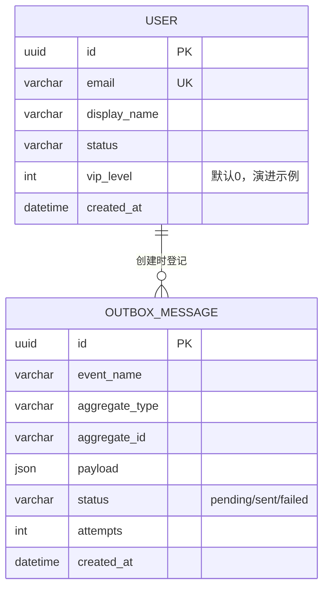

# 服务模板（用户服务原型）· 模块说明书

> 模块说明书是“AI 协作锚点”（方向四）的标准产物。新服务复制本目录后，按本模板逐项填写。

## 1. 服务职责

- 拥有并管理 **users** 表（数据主权：唯一 Owner）。
- 创建用户：本地事务 + Outbox 发布 `user.created.v1`。
- 查询用户：数据级授权（仅本人或 admin）。

## 2. API 契约

- 契约文件：`contracts/http/template.openapi.yaml`（唯一事实来源）
- 契约 SDK 镜像：`contract_sdk/schemas/http.py`
- 错误格式：RFC 9457 Problem Details（`application/problem+json`）

## 3. 核心表 ER



## 4. 数据归属边界

| 拥有 | 只引用 ID | 严禁访问 |
|---|---|---|
| `users`、`outbox_messages` | 其他服务的 `*_id` | 其他服务的任何表 |

## 5. 事件

| 方向 | 事件 | 契约 |
|---|---|---|
| 发布 | `user.created.v1` | `contracts/events/user.created.schema.json` |
| 订阅（示例） | `order.created.v1` | 待订单服务定义 |

## 6. 非功能要求与完成定义

- [x] 副作用接口支持 `Idempotency-Key`
- [x] 本地事务 + Outbox（禁止提交前直发 MQ）
- [x] 数据级授权默认拒绝（仅本人/admin）
- [x] 结构化日志带 request_id / trace_id；trace 上下文透传
- [x] `/health/live` + `/health/ready`
- [ ] 生产接入 RabbitMQ（当前开发用 LocalEventBus）
- [ ] 生产迁移用 Alembic（当前测试用 create_all）

## 7. 本地运行

```powershell
# 从仓库根目录
scripts\dev.ps1            # uvicorn app.main:app --reload --port 8100
scripts\test.ps1           # 全部测试
```